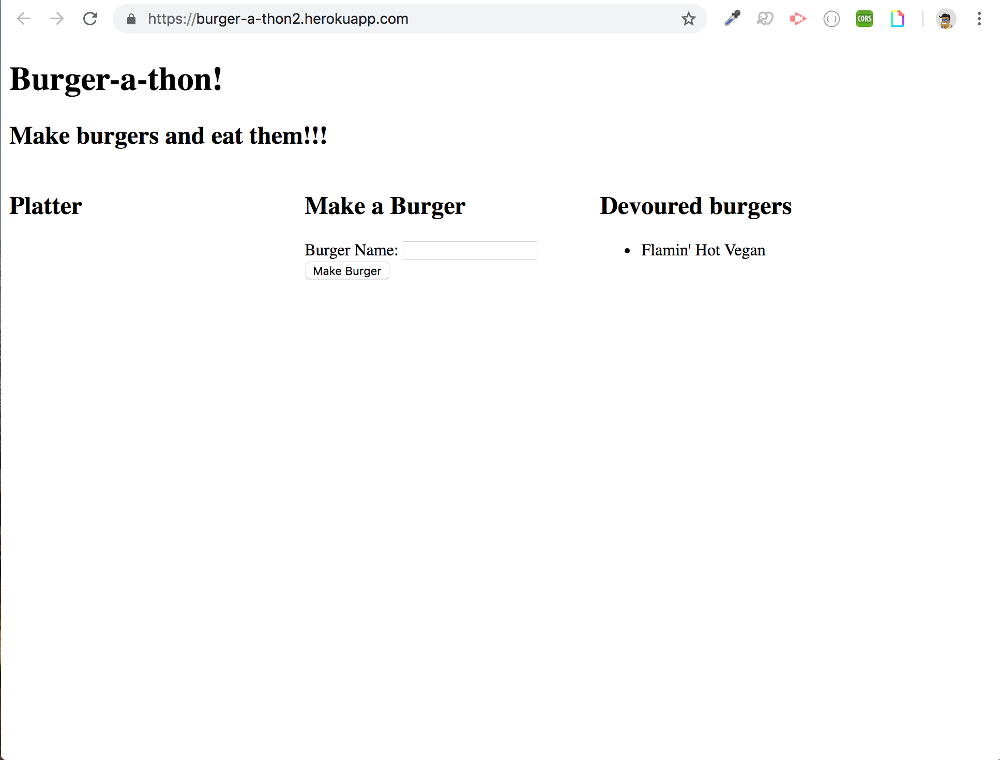
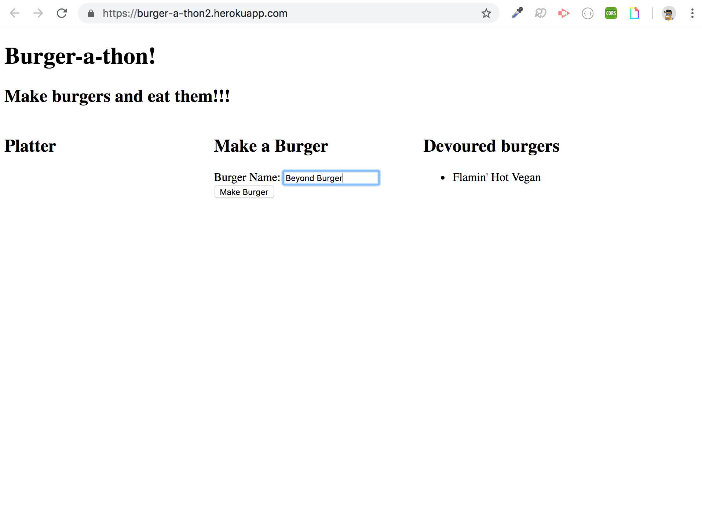
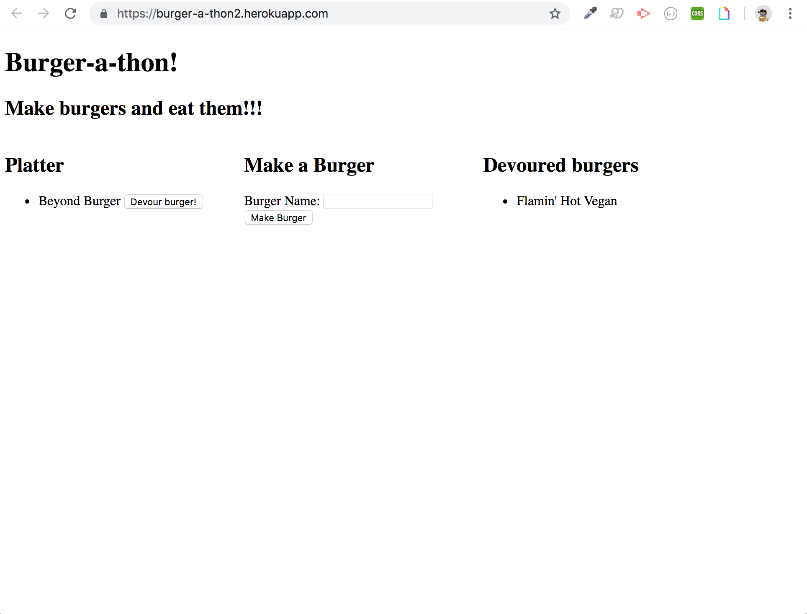
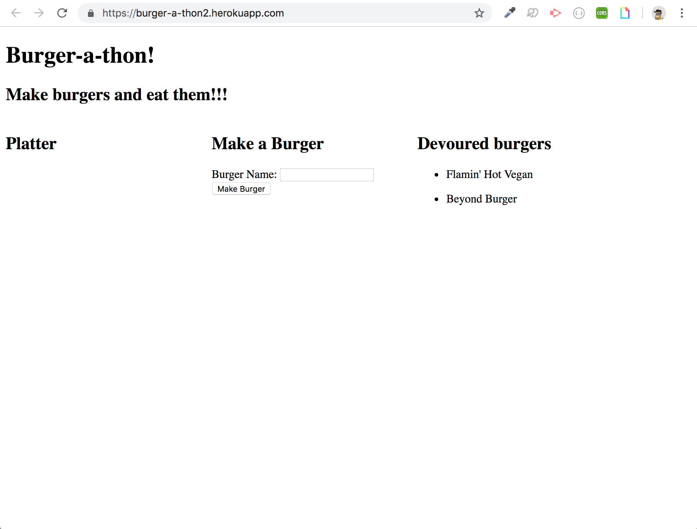

# burger
deployed at: https://burger-a-thon2.herokuapp.com/, burger (or burger-a-thon) is a restaurant app that lets users input the names of burgers they'd like to eat and then devour them. Burger data is saved on an AWS server.

### The home page:

### Adding a burger

### Burger added

### After clicking "devour burger"

